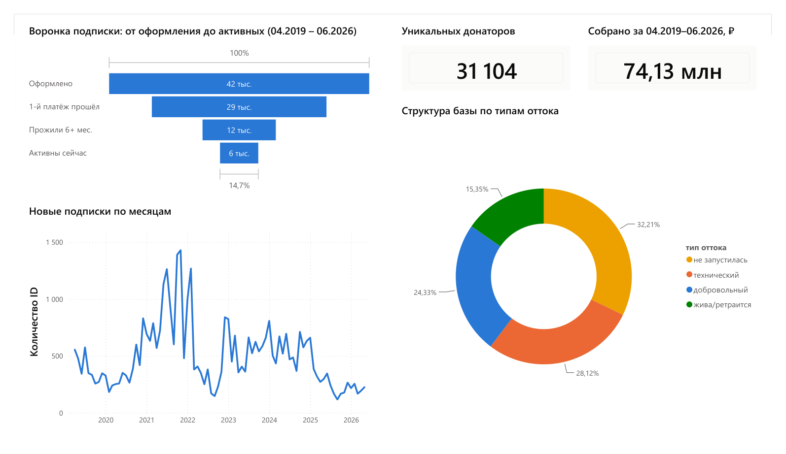
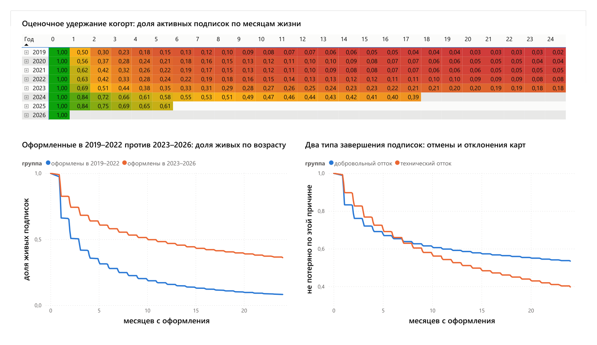
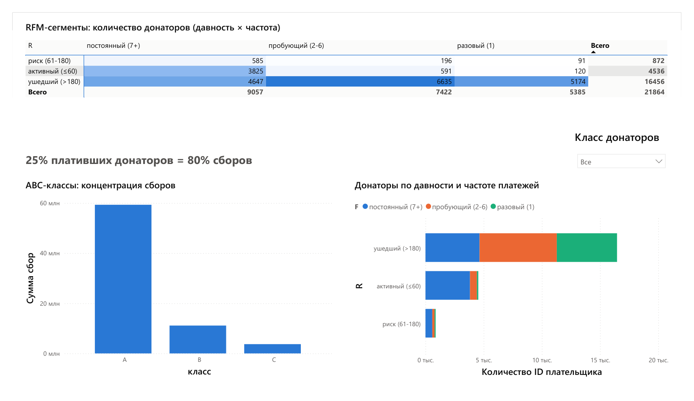

# Анализ платежей донаторов БФ «Марафон добра»

Аналитическое исследование регулярных пожертвований благотворительного фонда:
поведение донаторов, эффективность подписочной модели и рекомендации по росту
регулярных сборов. Выполнено по заказу фонда «Марафон добра»
(июль–сентябрь 2026).



## Данные

Выгрузка подписок CloudPayments: **42 806 подписок** на ежемесячные карточные
пожертвования за период 04.2019 – 06.2026 (31 104 донатора, 74,1 млн ₽,
238 277 списаний). Одна строка = подписка, а не платёж. Разовые пожертвования
и другие каналы оплаты в выгрузку не входят — выводы относятся к регулярным
карточным пожертвованиям.

> **Данные фонда в репозиторий не выкладываются** — ни сырая выгрузка, ни витрины
> уровня подписки/донатора, ни `.pbix` (он хранит внутри полную модель данных).
> Для запуска положите файл `encoded_Подписки Cloud Payments 18-06.csv`
> в корень проекта; витрины для дашборда ноутбук сгенерирует сам.

## Ключевые результаты

- Улучшены **оба этапа жизненного цикла**: активация выросла с ~50% до ~83%
  (2024–2025; 2026 год не завершён), а активированные подписки, оформленные
  с 2023 года, удерживаются **в 3,4 раза дольше** (медиана 306 дней против 89;
  логранк p < 0,001).
- **Главный риск — приток**: новых подписок −34% (2025) и ещё −45% (2026)
  к сопоставимым периодам января–мая. Реальное падение глубже: пятая часть
  новых подписок 2026 года принадлежит техническому плательщику, без него
  органический приток падает примерно на 56%.
- **Отток на две трети технический**: 38% потерь — подписка не дожила
  до первого регулярного списания, 33% — отказ карты у действующей подписки,
  и лишь 29% — решение донатора уйти.
- **Ценность донатора определяет постоянство, а не размер чека**: донаторы
  с 7+ платежами — 41% плативших и 86% сборов; 25% плативших (класс A) дают
  80% денег при пороге входа всего 3 300 ₽ за всю историю.
- ~6% «оттока» — кандидаты на переоформление: изменить сумму или карту можно
  только через отмену подписки.

Рекомендации фонду — раздел 13 ноутбука и страница «Выводы» дашборда.

## Методы

- Проверки качества данных (согласованность полей, дубликаты, assert-контроли)
  и согласованные с заказчиком правила очистки; расследование аномальных
  плательщиков перед исключением.
- **Воронка активации**: оформление → первый успешный платёж → регулярность.
  Активация и удержание считаются раздельно — их смешение искажает обе оценки.
- **Когортный анализ**: оценочное удержание по месяцам жизни, помесячные
  и годовые когорты, отдельно по всем оформленным и по активированным.
- **Survival-анализ** (Каплан–Майер, `lifelines`) по активированным подпискам;
  сравнение периодов привлечения с логранк-тестом; упрощённый анализ типов
  завершения — добровольные отмены против отклонений карты.
- **RFM-сегментация** донаторов с бизнес-порогами (от цикла списаний, а не
  от перцентилей) и **ABC/Парето**-анализ концентрации сборов.
- Self-join-поиск переоформлений подписок с проверкой чувствительности к окну.
- **SQL-слой (DuckDB)**: ключевые расчёты продублированы на SQL как перекрёстная
  проверка — все контрольные цифры сошлись с pandas-версией.
- Основные этапы оформлены функциями (`load_data()` → `export_marts()`)
  с docstring; целостность данных контролируется assert-проверками.

## Ограничения данных

Осознанная часть работы: что этой выгрузкой измерить нельзя.

- **Помесячной истории списаний нет** — известны только счётчик платежей и дата
  последнего. Поэтому объём сборов по месяцам не восстанавливается, а удержание
  реконструировано из длительности жизни подписки (в заголовках — «оценочное»).
- **Даты отмены нет** — конец жизни подписки приближён датой последнего платежа.
  Смещение асимметрично (среди активированных 2019–2022 живо 4%, среди
  2023–2026 — 40%), поэтому разрыв удержания ×3,4 — скорее верхняя оценка.
- **Платёж при оформлении в счётчик не входит** (подтверждается лагом «первый
  платёж — создание» в 28–31 день), поэтому «0 платежей» означает «не дожила
  до первого регулярного списания», а не «платёж не прошёл».
- **Списания дискретны** (раз в 28–31 день), поэтому контрольные точки
  survival-кривой сняты между списаниями (45/105/198/380 дней): значения ровно
  на 30/91/183/365 днях зависели бы от длины календарного месяца, а не
  от поведения донатора.
- **Источника привлечения в данных нет** — сегментация по каналам и трактовка
  всплесков невозможны; совпадение роста удержания с внедрением CRM-маркетинга
  фонда остаётся совпадением, а не доказанной причинностью.

## Дашборд

Power BI, 4 страницы: обзор и воронка, удержание и survival, RFM/ABC-сегменты,
выводы и рекомендации. В репозитории — проект `.pbip` (определения отчёта
и модели, без данных), PDF-версия и скриншоты.

| Удержание и survival | Сегменты донаторов |
|---|---|
|  |  |

## Структура проекта

```
├── Марафон_добра_анализ_подписок.ipynb   # основной отчёт: 13 разделов, весь анализ и выводы
├── powerbi_data/
│   ├── donor_dashboard.pbip              # проект Power BI: .Report + .SemanticModel
│   ├── donor_dashboard.pdf               # PDF-версия дашборда
│   └── powerbi_theme.json                # тема оформления
├── docs/                                 # скриншоты страниц дашборда
├── requirements.txt
└── README.md
```

## Запуск

```bash
pip install -r requirements.txt
jupyter notebook Марафон_добра_анализ_подписок.ipynb   # Restart & Run All
```

Пути в ноутбуке относительные (`pathlib`), витрины для Power BI создаются
в `powerbi_data/` при прогоне.

## Стек

Python (pandas, NumPy, matplotlib, lifelines) · SQL (DuckDB) · Power BI (DAX)
