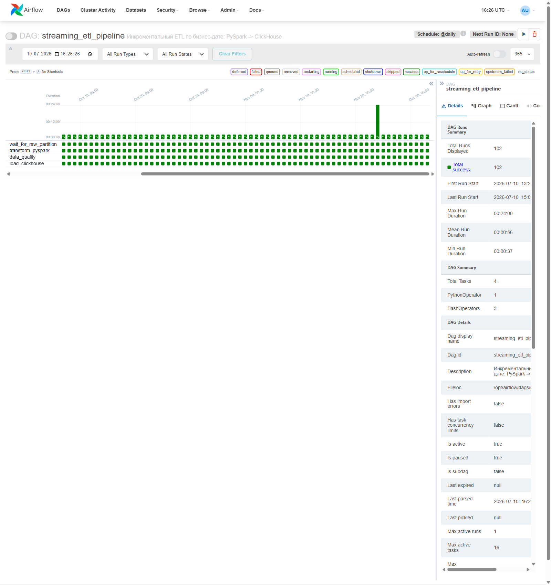
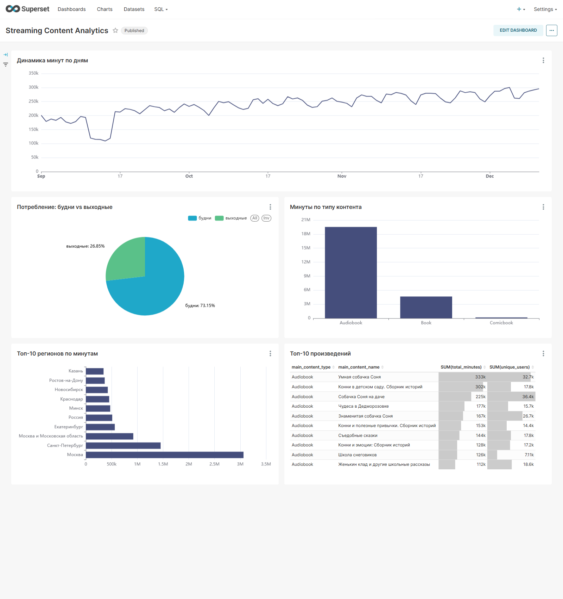

# ETL-пайплайн аналитики стримингового сервиса

Пайплайн, который каждый день превращает сырые логи прослушиваний стримингового сервиса
(аудиокниги, книги, комиксы) в готовые таблицы для аналитики. Данные считаются на PySpark,
хранятся в ClickHouse и показываются в дашборде Superset; всей цепочкой управляет Airflow.
Проект поднимается локально одной командой через Docker.

## Задача

Сервис фиксирует около 10 тысяч прослушиваний в день (в наборе данных — 102 дня, порядка
миллиона событий). Продуктовой и маркетинговой командам нужны свежие метрики потребления —
по типам контента, географии и сегментам аудитории. Собирать их вручную каждый день долго
и ненадёжно, поэтому нужен пайплайн, который делает это сам по расписанию и умеет пересчитать
любой прошедший день, если данные изменились или что-то сломалось.

## Как устроено

Ключевое решение — считать данные по одному дню, а не пересчитывать всё разом. Логи копятся
посуточно, и пайплайн повторяет эту логику: у каждого запуска своя дата. Благодаря этому
расписание, повторные прогоны и пересчёт истории ведут себя предсказуемо — любой день можно
пересобрать, не трогая соседние, а сбой лечится повторным запуском той же даты.

Один прогон — четыре шага:

1. **Ожидание данных.** Пайплайн стартует, только когда логи за нужную дату готовы. В боевой
   системе это был бы файл в облачном хранилище; здесь тот же смысл воспроизведён локально.
2. **Обработка на PySpark.** Читаем данные только за эту дату, приводим типы, считаем производные
   поля (минуты сессии, признак выходного дня), убираем пропуски, соединяем со справочником
   контента и снимаем дубли по идентификатору события.
3. **Контроль качества.** Прежде чем что-то попадёт в хранилище, проверяем результат: данные за
   день есть, отрицательных значений нет, уникальных слушателей не больше, чем сессий (иначе
   агрегация где-то сломалась). Если проверка не прошла — пайплайн останавливается, и битые
   данные до ClickHouse не доходят.
4. **Загрузка в ClickHouse.** Результат записывается так, что повторный запуск за ту же дату
   заменяет её, а не добавляет копии. Поэтому и перезапуск после сбоя, и пересчёт всей истории
   безопасны — дублей не появится.

```
логи за дату → ожидание → PySpark → контроль качества → ClickHouse → Superset
                          оркестрация: Airflow, ежедневно
```

## Витрины

На выходе — три готовые таблицы, каждая отвечает на свой вопрос: **что слушают** (метрики по типам
контента с разбивкой на детское/взрослое и будни/выходные), **где слушают** (страны и регионы)
и **что именно популярно** (те же метрики по каждому произведению; топ-N строится запросом
в дашборде). Все три хранятся в ClickHouse по дням — поэтому отдельную дату можно перезалить,
не трогая остальные.

## Что показал анализ данных

Разведку я вынесла в `notebooks/exploration.ipynb`. Если коротко:

- при соединении со справочником теряется около 0,6% событий — это контент, которого нет
  в каталоге; на выводы такая потеря не влияет, аудитория почти не затронута;
- в будни слушают заметно больше, чем в выходные, — типичное поведение сервиса, который
  включают фоном в повседневной рутине;
- взрослого контента по времени прослушивания примерно вчетверо больше детского.

Из этих наблюдений и выросли разрезы витрин.

## Результаты

**Пайплайн.** Пересчёт всей истории — с 1 сентября по 11 декабря 2024 (102 дня) — прошёл без сбоев:
**102 запуска из 102 успешны**, каждый меньше минуты. Проверки качества пройдены, юнит-тесты
зелёные, повторная загрузка даты дублей не создаёт. В ClickHouse легло 830 / 71 364 / 248 150 строк
по трём витринам.



**Что показали данные.**

- в будни слушают в 2,7 раза больше, чем в выходные (17,8 против 6,5 млн минут);
- аудиокниги — около 80% всего времени прослушивания, книги ~19%, комиксы меньше 1%;
- при связке со справочником совпало 99,4% событий;
- с большим отрывом лидируют Москва (3,1 млн минут) и Санкт-Петербург (1,5 млн);
- с сентября к декабрю дневное потребление выросло примерно с 200 до 290 тыс. минут в день.



## Как запустить

```bash
# 0. секреты и данные
cp .env.example .env      # задать CH_PASSWORD, SUPERSET_SECRET_KEY, SUPERSET_ADMIN_PASSWORD
#    положить data/content.csv и data/audition.csv (схема — data/README.md)
docker compose up -d --build

# 1. создать таблицы-витрины в ClickHouse
docker exec -i sce-clickhouse sh -c 'clickhouse-client --user etl --password "$CH_PASSWORD" --multiquery' < sql/clickhouse_ddl.sql

# 2. разово разложить сырые данные по датам
docker exec sce-airflow python /opt/airflow/project/src/prepare_raw.py \
  --content /opt/airflow/project/data/content.csv \
  --audition /opt/airflow/project/data/audition.csv \
  --out /opt/airflow/project/data/raw

# 3. посчитать всю историю (102 дня)
docker exec -u airflow sce-airflow airflow dags backfill \
  -s 2024-09-01 -e 2024-12-11 streaming_etl_pipeline
```

- **Airflow** — http://localhost:8080 (логин `admin`, пароль печатается в логах контейнера:
  `docker logs sce-airflow | grep -i password`).
- **Superset** — http://localhost:8088 (логин и пароль из `.env`). Подключение к ClickHouse и
  датасеты создаются автоматически при старте; дашборд собирает скрипт `docker/build_dashboard.py`.
- **Тесты** — `docker exec -u airflow -w /opt/airflow/project sce-airflow python -m pytest -q`.

## Секреты

Паролей в репозитории нет — все ключи берутся из `.env`, которого в git нет; в репозитории лежит
только шаблон `.env.example`. Пароль ClickHouse подставляется в конфиг из переменной окружения,
Superset читает креды оттуда же.

## Технические заметки

Три момента, решение которых заняло больше времени, чем ожидалось:

- Официальный образ ClickHouse, если не задать ему пользователя и пароль через переменные
  окружения, молча закрывает сетевой доступ пользователю `default`. Локально всё работает,
  а из соседнего контейнера — уже нет. Поэтому в проекте заведён отдельный пользователь `etl`
  с доступом по сети.
- Данные ClickHouse лучше держать в docker-volume, а не в папке на диске: на Windows монтирование
  папки ломает запись из-за прав NTFS.
- Spark запускается внутри контейнера — локально на Windows он не запишет Parquet без отдельной
  возни с Hadoop.

## Структура репозитория

```
streaming-content-etl/
├── README.md · requirements.txt · pytest.ini · .gitignore
├── .env.example                 # шаблон секретов (сам .env — вне git)
├── Dockerfile · Dockerfile.superset · docker-compose.yml
├── docker/
│   ├── clickhouse-users.xml     # пользователь etl с доступом по сети
│   ├── register_clickhouse.py   # авто-подключение ClickHouse к Superset
│   └── build_dashboard.py       # сборка дашборда из витрин
├── src/
│   ├── prepare_raw.py           # CSV → Parquet, раскладка по датам (разово)
│   ├── transform.py             # PySpark: одна дата → витрины
│   ├── data_quality.py          # проверки качества
│   └── load_clickhouse.py       # загрузка с заменой дня (без дублей)
├── dags/streaming_etl_dag.py    # Airflow DAG по бизнес-дате
├── sql/clickhouse_ddl.sql       # DDL витрин (ClickHouse, деление по дате)
├── tests/test_transform.py      # pytest на трансформации
├── notebooks/exploration.ipynb  # разведочный анализ
├── docs/                        # скриншоты Airflow и дашборда
└── data/README.md               # схема данных (сами CSV — вне git)
```

## Технологии

PySpark · Apache Airflow · ClickHouse · Apache Superset · Parquet · Docker · pytest · Python · SQL
